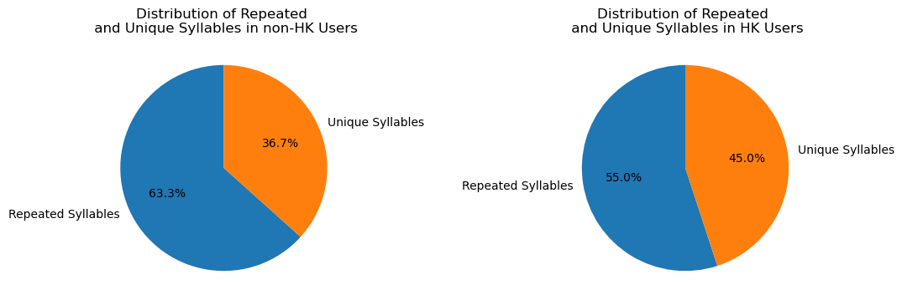
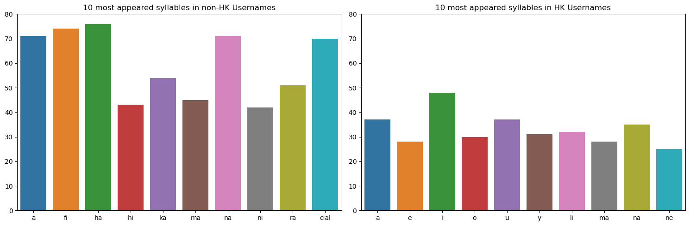
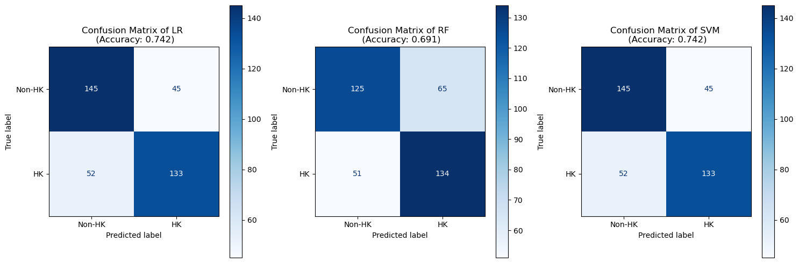

# Hong Kong Instagram Username Identification

A NLP pipeline that identifies Hong Kong Instagram users solely based on username patterns.

## 🌱 About
This binary classification project identifies Hong Kong Instagram users **without** relying on **real-time scraping** or **API calls** on the users' **metadata**. Instead, my model uses the underlying syllable patterns in usernames for the classification task.

An example use case for my identifier can be creating a **lightweight IG ad bot** that exclusively engages with Hong Kong IG users for social media marketing purposes.

Scikit-learn's **Logistic Regression**, **Random Forest** and **SVM** are chosen as the baseline models for evaluation.

The [username data](datasets) is collected from [hypeauditor.com](https://hypeauditor.com/) using a [Selenium-based web scraper](hypeauditor_scraper.py).

> *try HK-Insta-Identifier yourself on my [streamlit app](https://hk-insta-identifier.streamlit.app/)!*

## 🚀 How Does It Work?

The core principle of this classification task revolves around the behavior of the NLTK syllable tokenizer and Romanized Cantonese linguistic features.       

Notably, the NLTK syllable tokenizer is not Romanized Cantonese-specific, but it could still provide a workaround by capturing some distinctive patterns.

The following are the visualizations of the distribution of repeated and unique syllables, and the top 10 most appeared syllables in HK and Non-HK usernames:

> Terminologies:
>
> * **Vowels**: a,e,i,o,u,y* and can be a standalone syllable
> * **Consonants**: characters that are not vowels and cannot be a standalone syllable
> * **Consonant-vowel (CV) syllables**: a syllable that contains both vowel and consonants, e.g. 'fi', 'ha', etc.
> * **Monosyllabic**: single/ one syllable
> 
> *Note: y sometimes can act as a vowel as well*

1. **Higher Appearance of standalone Vowels in HK** -> Unique Vowel Clusters
    * Romanized Cantonese has a lot of unique adjacent vowels compared to English or other languages
    * For example: {"張": "ch-***eu***-ng", "楊": "  ***yeu***-ng", "趙": "ch-***iu***", "游": "  ***yau***", ...}
    * The tokenizer is not familiar with these clusters and might treat them as an individual syllable

2.  **Less CV syllables, more Unique Syllables in HK**-> Complex Consonants Clusters
    * Romanized Cantonese also has a lot of complex consonants combinations and some can even contain no vowels at all.
    * For example : {"翠": "***ts***-ui", "芷": "  ***tsz***", "吳": "***ng***", "郭": "***kw***-ok", ...}
    * This confuses the tokenizer to group the consonants to other vowels, resulting in more unique syllables

3. **Lower Frequency of a syllable in HK** -> Monosyllabic Chinese Characters
    * The maximum frequency of a syllable is around 75 ("ha") in Non-HK while it is only roughly 50 ("i") in HK 
    * Hong Kong People's name are mostly made up of 3 Chinese characters, and each chinese character only has one syllable
    * i.e. Hong Kong people's name at most have 3 syllables and leads to overall lower frequency of syllables in usernames

All these differences contributed as the patterns for the models to identify HK usernames from non-HK usernames.

## 👀 Why Syllable Tokenizer?

In NLP, conventional tokens might be words, phrases, or subword units. On the contrary, syllabic tokenization is regarded as a rather "**inconsistent**" tokenization technique since the phonetics in the English language is also inconsistent, such as the "k" in "knife" or "olo" in "colonel". 

However, I found that syllabic tokenization is still the optimal existing solution in tokenizing usernames with following reasons:

1. **No whitespaces between words** 
    * Lack of whitespaces in the Instagram usernames makes the traditional tokenizers that heavily rely on whitespaces cannot work properly.

2. **Usernames are not sentences**
    * In other words, usernames are too short to extract a "word" as a unit for the features.

3. **Usernames are not proper English**
    * Usernames are not proper English vocabularies, any conventional tokenizers will not have the word embeddings for usernames, so a subword tokenizer that tokenizes a word based on the prefixes and suffixes would also not work.

4. **No Romanized Cantonese-specific tokenizer**
    * The crucial reason to use syllable tokenizer is the absence of a pretrained Romanized Cantonese tokenizer. As demonstrated in the last part, syllabic tokenizer can somehow still be able to identify some unique patterns, albeit the lack of Cantonese embeddings.        

> *learn more in [Forbidden Spellings](https://www.youtube.com/shorts/3ipFdRfFvK4) & [NLP pipeline deep dive: Why doesn't anyone tokenize by syllables?](https://www.youtube.com/watch?v=4_KxnoMnVVs&t=2990s&ab_channel=RachaelTatman)*

## ✅ Results

After running a GridSearchCV, it was found that both **Logistic Regression (LR)** and **Support Vector Machines (SVM)** yielded the best testing results with **0.742**. On the other hand, Random Forest (RF) with 0.691  showed the worst performance due to potential underfitting.

## ⚠️ Limitations 

Username analysis is a *super super* complicated topic because of the freedom and creativity users have when choosing their usernames, for example:  
- **Private account holders** may choose not to include their government (Cantonese) names in their usernames.  
- **English names** are widely adopted by many Hong Kong users and greatly reduce the visibility of linguistic patterns tied to Cantonese.  
- There is often **overlap among Romanized Chinese dialects**, making it difficult to distinguish between users from different regions.  

So while my approach might seem effective, you have to carefully consider these factors when interpreting the results of this project.

## ❤️ Thank You 
If you find this project interesting, feel free to **star**🌟or **fork** this repo and explore new ideas to build on this work - collaboration is always welcome! 

Possible future directions could include developing a Romanized Cantonese-specific tokenizer and incorporating users' bios information.

Thank you again for taking the time to learn about this project!

> *please consider checking out [hk_ig_clf.ipynb](hk_ig_clf.ipynb) or [hk_ig_clf.pdf](hk_ig_clf.pdf) for full details.*
