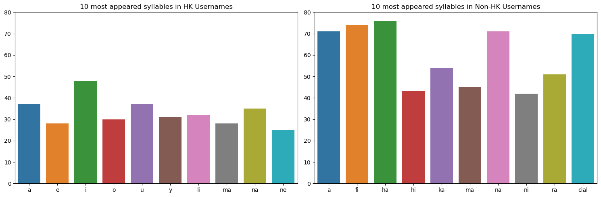
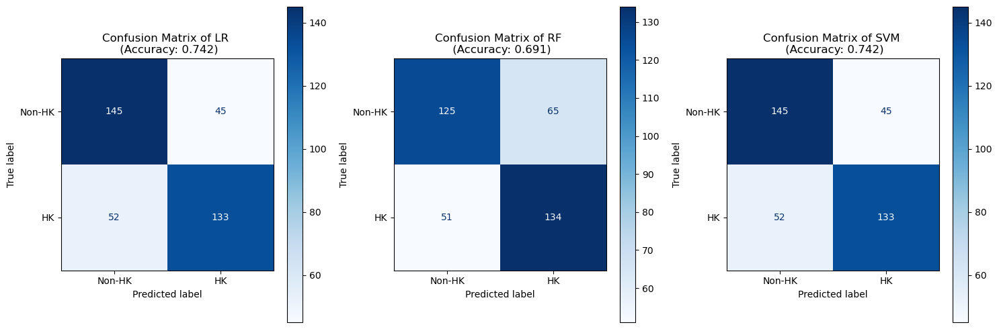

# Hong Kong Instagram Username Classification

Hong Kong Instagram username classification that utilizes the behavior of the NLTK syllable tokenizer and linguistic features of Romanized Cantonese.

## Introduction

Identifying Hong Kong Instagram users among the global userbase can greatly enhance resource allocation and marketing strategies for businesses. An implementation can be creating an Instagram advertising bot that exclusively targets and engages with users in Hong Kong. 

The training data of this project is collected from [HypeAuditor](https://hypeauditor.com/) using my own web scraper **hypeauditor_scraper.py**.

Scikit-learn's **Logistic Regression**, **Random Forest** and **SVM** are chosen as the baseline models for evaluation.

## How does the Classification Work?

The core principle of this classification task revolves around the behavior of the NLTK syllable tokenizer and the distinctive linguistic features of Romanized Cantonese.        

Notably, the NLTK syllable tokenizer is not Cantonese-specific, but it could still provide a workaround by capturing some distinctive patterns based on the behavior of the NLTK tokenizer, albeit the lack of Cantonese word embeddings.

The following is the visualization of the top 10 most appeared syllables in HK and Non-HK usernames:

> Terminologies:
>
> * **Vowels**: a,e,i,o,u,y* and can be a standalone syllable
> * **Consonants**: characters that are not vowels and cannot be a standalone syllable
> * **Consonant-vowel (CV) syllables**: a syllable that contains both vowel and consonants, e.g. 'fi', 'ha', etc.
> * **Monosyllabic**: single/ one syllable
> 
> *Note: y sometimes can act as a vowel as well*

1. **Higher Appearance of standalone Vowels in HK** -> Unique Vowel Clusters
    * Romanized Cantonese has a lot of unique adjacent vowels compared to English or other languages
    * for example: {"張": "ch-***eu***-ng", "楊": "  ***yeu***-ng", "趙": "ch-***iu***", "游": "  ***yau***", ...}
    * the tokenizer is not familiar with these clusters and might treat them as an individual syllable

2.  **Less CV syllables, more Unique Syllables in HK**-> Complex Consonants Clusters
    * Romanized Cantonese also has a lot of complex consonants combinations and some can even contain no vowels at all.
    * for example : {"翠": "***ts***-ui", "芷": "  ***tsz***", "吳": "***ng***", "郭": "***kw***-ok", ...}
    * this confuses the tokenizer to group the consonants to other vowels, resulting in more unique syllables

3. **Lower Frequency of a syllable in HK** -> Monosyllabic Chinese Characters
    * the maximum frequency of a syllable is around 75 ("ha") in Non-HK while it is only roughly 50 ("i") in HK 
    * Hong Kong People's name are mostly made up of 3 Chinese characters, and each chinese character only has one syllable
    * i.e. Hong Kong People's name at most have 3 syllables and leads to overall lower frequency of syllables in usernames

All these differences contributed as the patterns for the models to identify HK usernames from non-HK usernames.

## Why Syllable Tokenizer?

In Natural Language Processing (NLP), conventional tokens might be words, phrases, or even subword units. On the contrary, syllabic tokenization is regarded as a rather "inconsistent" tokenization technique since the phonetics in the English language is also somewhat "inconsistent", such as the "k" in "knife" and "olo" in "colonel". 

Nonetheless, I found that syllabic tokenization is still the most suitable choice in classifying usernames with the following reasons:

1. **No whitespaces between words** 
    * Lack of whitespaces in the Instagram usernames makes the traditional tokenizers that heavily rely on whitespaces cannot work properly.

2. **Usernames are not sentences**
    * In other words, usernames are too short to extract a "word" as a unit for the features.

3. **Usernames are not proper English**
    * Usernames are not proper English vocabularies, any conventional tokenizers will not have the word embeddings for usernames, so a subword tokenizer that tokenizes a word based on the prefixes and suffixes would also not work.

4. **No Cantonese-specific tokenizer**
    * The crucial reason to use syllable tokenizer is the absence of a pretrained Romanized Cantonese tokenizer. As demonstrated in the last part, syllabic tokenization can somehow identify some unique patterns based on the behavior of the NLTK tokenizer.        

> *learn more in [Forbidden Spellings](https://www.youtube.com/shorts/3ipFdRfFvK4) & [NLP pipeline deep dive: Why doesn't anyone tokenize by syllables?](https://www.youtube.com/watch?v=4_KxnoMnVVs&t=2990s&ab_channel=RachaelTatman)*

## Results

After tuning the hyperparameters and conducting validations, it was found that both **Logistic Regression (LR)** and **Support Vector Machines (SVM)** yielded the best testing results with **0.742**. On the other hand, Random Forest (RF) with 0.691  showed the worst performance due to potential underfitting or overfitting.

In the end, **SVM** was chosen over LR for actual deployment due to its **scalability**. Although they show similar performance, as the dataset grows larger, LR may face challenges in capturing non-linear relationships of the syllables effectively. 

On the other hand, SVM is capable of handling non-linear relationships and can scale well to accommodate larger datasets with well-tuned hyperparameters and the kernel trick. However, if simplicity and computational cost are the main concerns, LR might be a more suitable choice to work with a small dataset. 

> *please consider checking out **hk_ig_clf.ipynb** for full details. Thank You!!*

